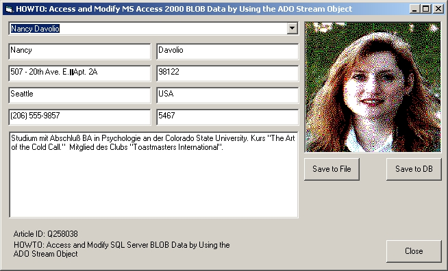



## Access and Modify MS Access BLOB Data by Using the ADO Stream Object

### Description

Store Files to Access-DB and restore them from DB to File and more...
 
### More Info
 
Dont mess around with the chunks. Stream it!

             |
---                |---
**Submitted On**   |2001-04-19 09:59:38
**By**             |[Mac](https://github.com/Planet-Source-Code/PSCIndex/blob/master/ByAuthor/mac.md)
**Level**          |Intermediate
**User Rating**    |4.0 (8 globes from 2 users)
**Compatibility**  |VB 6\.0
**Category**       |[Databases/ Data Access/ DAO/ ADO](https://github.com/Planet-Source-Code/PSCIndex/blob/master/ByCategory/databases-data-access-dao-ado__1-6.md)
**World**          |[Visual Basic](https://github.com/Planet-Source-Code/PSCIndex/blob/master/ByWorld/visual-basic.md)
**Archive File**   |[Access and185354192001\.zip](https://github.com/Planet-Source-Code/mac-access-and-modify-ms-access-blob-data-by-using-the-ado-stream-object__1-22508/archive/master.zip)

### API Declarations

to much

